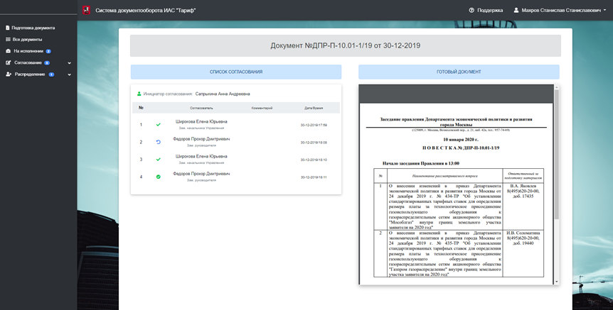

## Система документооборота ИАС "Тариф"
Система разработана как универсальное решение для автоматизации подготовки документов с возможностью дальнейшей передачи цифровых данных во внешние сервисы. В данной версии устанановлено наполнение для профиля тарифного регулирования.

Учетные данные для входа в систему:

Логин: admin

Пароль: admin

Деплой системы для ознакомления: http://109.68.16.185:8080/esrd

Использованный стек технологий: J2EE / Java 8 / Spring Boot / Security / Data-JPA / Stream API / PostgreSQL / RESTful API / JAX-WS / Lombok / MDBootstrap (css/js) / jQuery + plugins

### Главная страница со статистикой и контролем  

### Ввод данных

### Формирование документа в PDF + Json

### Демонстрация работы
