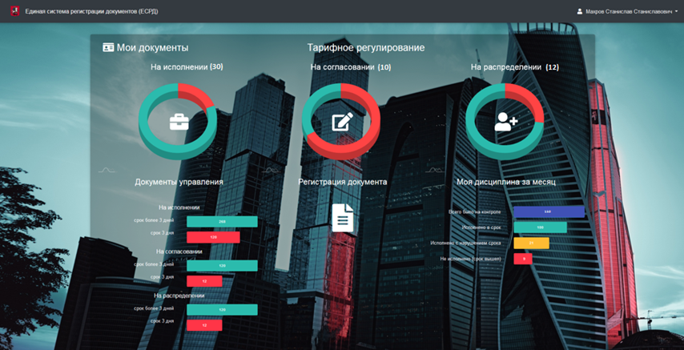
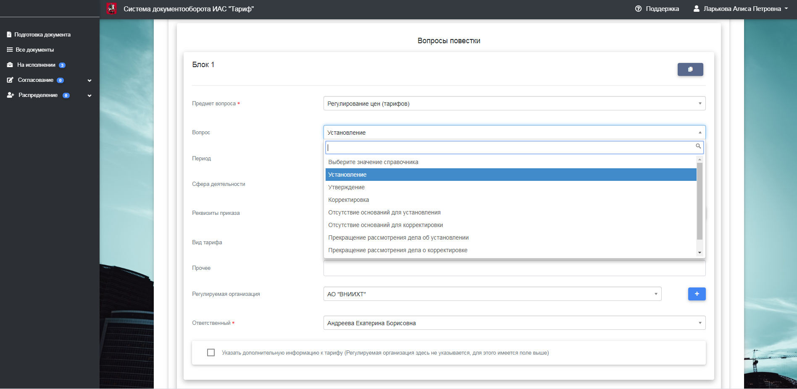

## Система документооборота ИАС "Тариф"
Система разработана как универсальное решение для автоматизации подготовки документов с возможностью дальнейшей передачи цифровых данных во внешние сервисы. В данной версии устанановлено наполнение для профиля тарифного регулирования.

Учетные данные для входа в систему:

Логин: admin

Пароль: admin

Деплой системы для ознакомления произведен на Heroku:

### Главная страница со статистикой и контролем  

### Формирование документа
